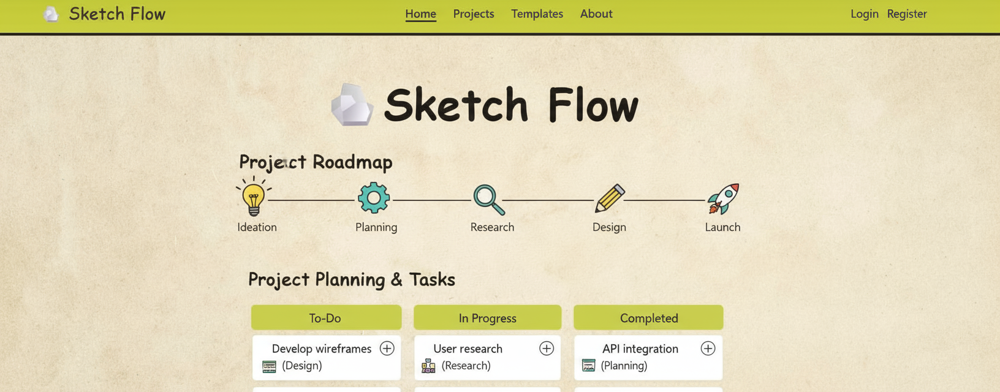
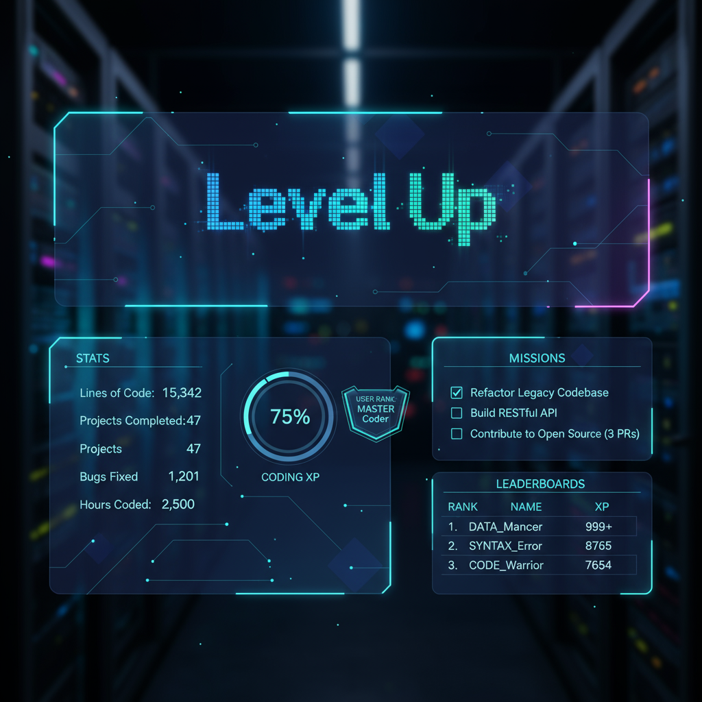

## Full-stack developer skilled in building end-to-end web applications ...

- 🖥️ Skilled in React.js, JavaScript, and modern frontend frameworks
- 🎯 Passionate about building scalable full-stack applications and UI/UX design
- 🚀 Currently working on impactful projects using Tailwind CSS, MongoDB, Node.js, and AWS
- 🌱 Constantly learning advanced React patterns, cloud deployment, and backend optimization
- ⚡ Dedicated to clean code, problem solving, and continuous improvement
---
**Connect with me:**

---

# 💻 Tech Stack

# 🐍 My Contribution Snake

  

---

# 📊 GitHub Stats

  
  &nbsp;&nbsp;
  
  &nbsp;

  

---

# 🚀 Projects

  &nbsp;&nbsp;&nbsp;
  

---

